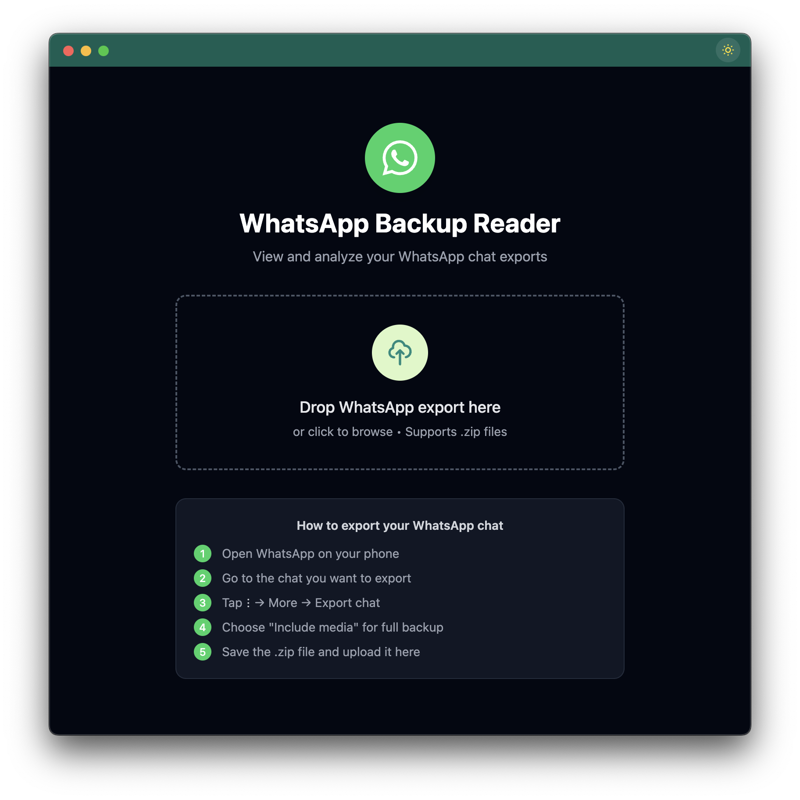
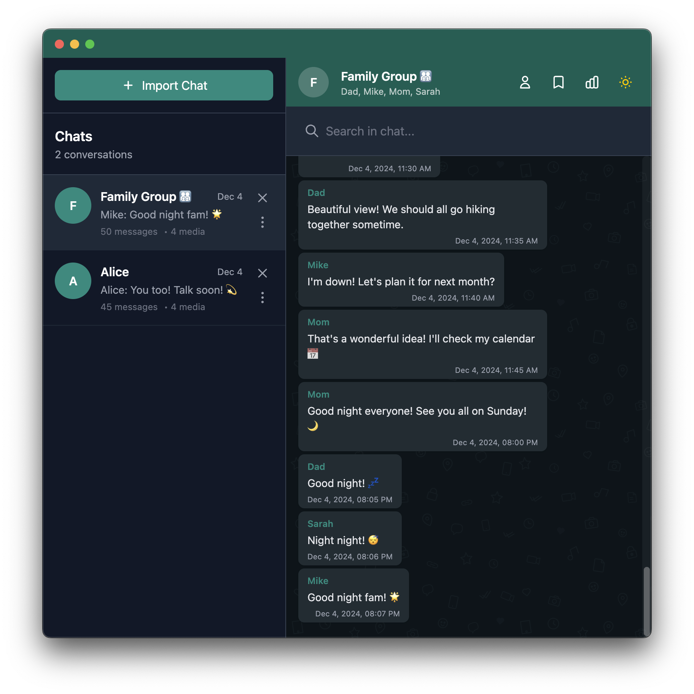
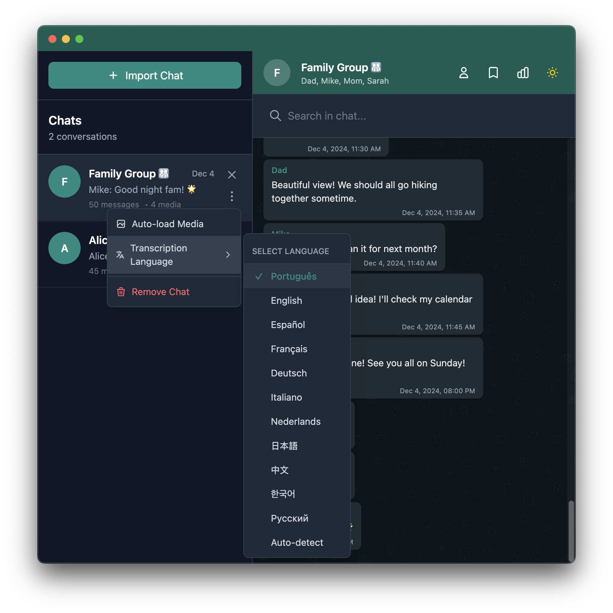
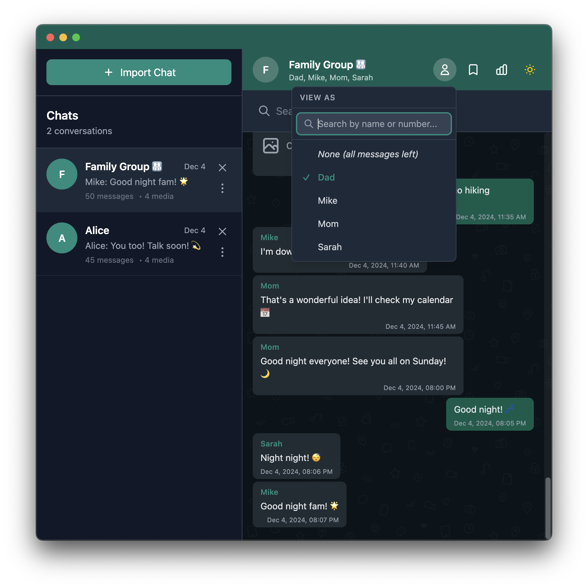
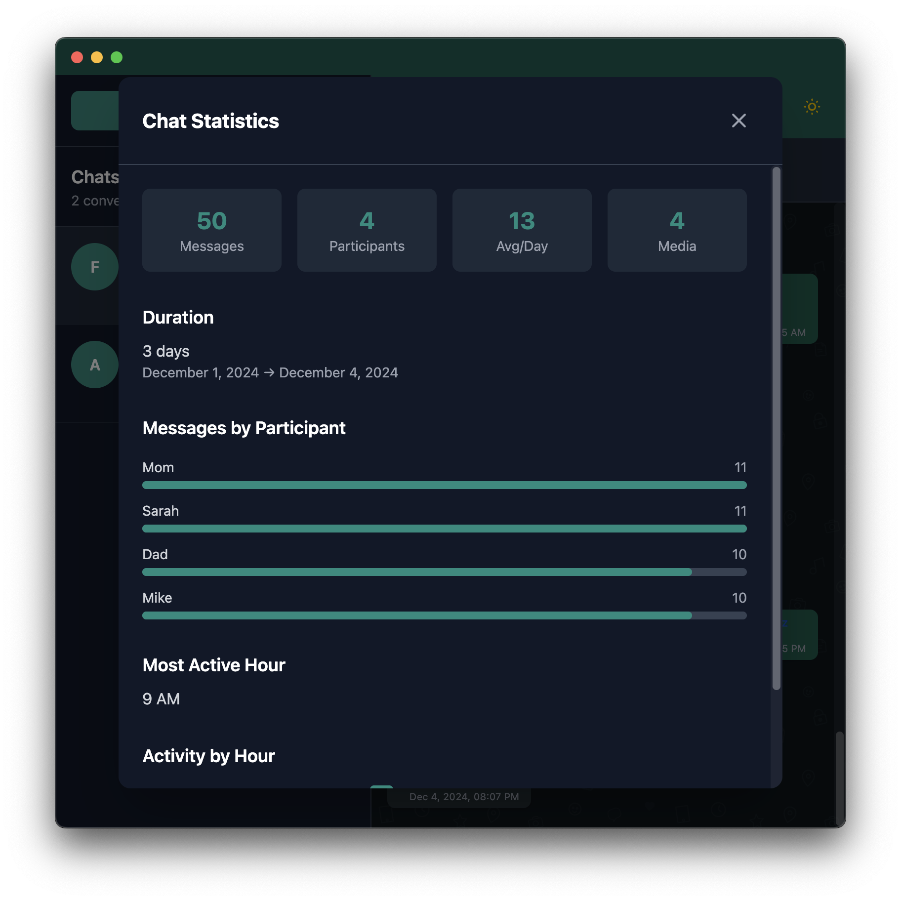
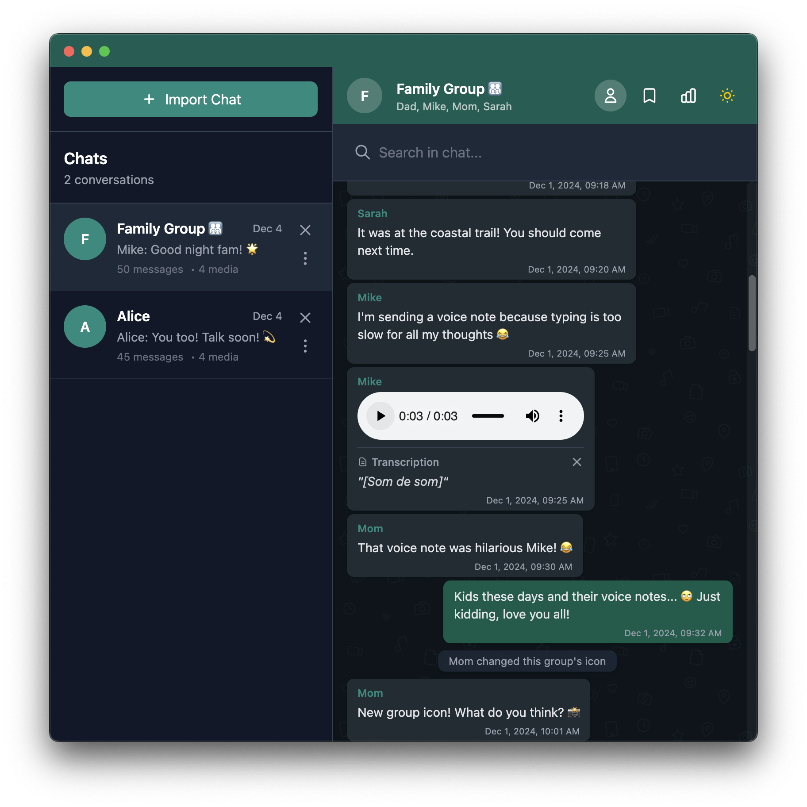
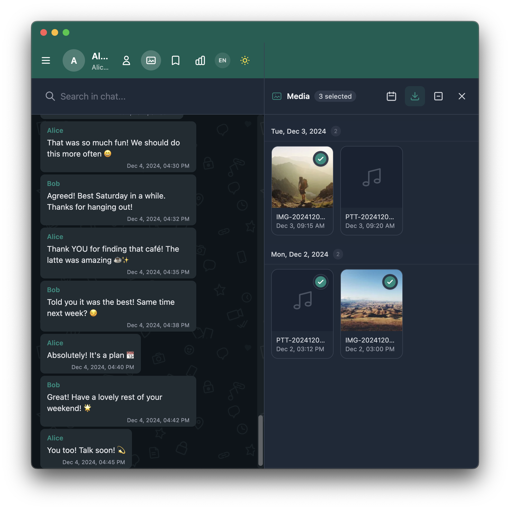
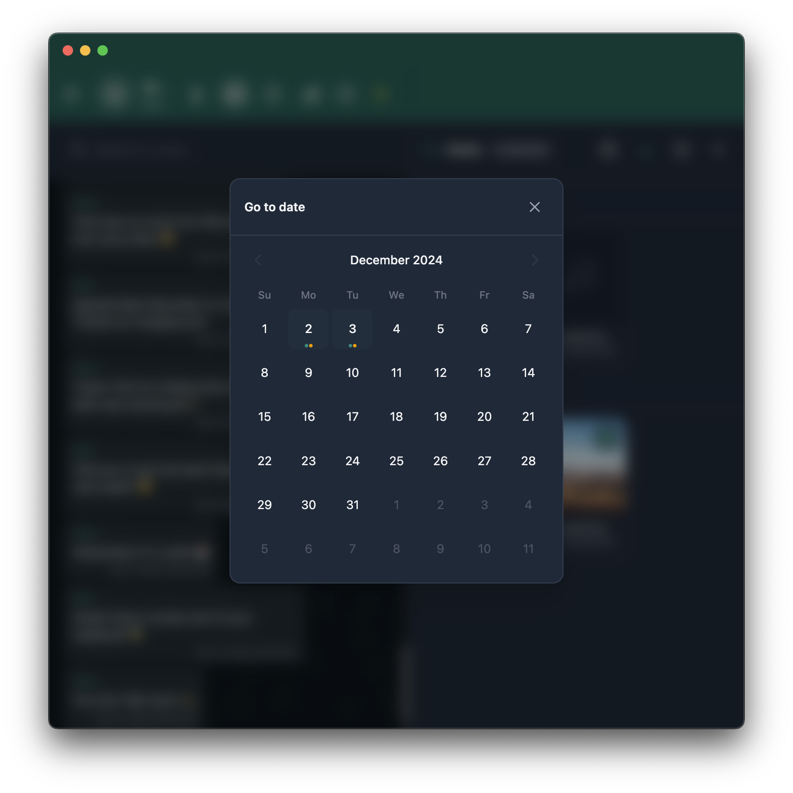

<h1 align="center">Читатель резервных копий WhatsApp</h1>

<p align="center">
  
</p>

<p align="center">
  <strong>Просматривайте экспорт WhatsApp офлайн. Ваши данные остаются на вашем устройстве.</strong>
</p>

<p align="center">
  <a href="https://github.com/rodrigogs/whats-reader/releases/latest"></a>
  <a href="https://github.com/rodrigogs/whats-reader/actions/workflows/ci.yml"></a>
  <a href="https://github.com/rodrigogs/whats-reader/blob/main/LICENSE"></a>
</p>

<p align="center">
  
  
  
  
</p>

<p align="center">
  <a href="README.md">English</a> •
  <a href="README.pt.md">Português</a> •
  <a href="README.es.md">Español</a> •
  <a href="README.fr.md">Français</a> •
  <a href="README.de.md">Deutsch</a> •
  <a href="README.it.md">Italiano</a> •
  <a href="README.nl.md">Nederlands</a> •
  <a href="README.ja.md">日本語</a> •
  <a href="README.zh.md">中文</a> •
  <strong>Русский</strong>
</p>

<p align="center">
  <a href="#основные-возможности">Основные возможности</a> •
  <a href="#быстрый-старт">Быстрый старт</a> •
  <a href="#как-экспортировать-из-whatsapp">Руководство по экспорту</a> •
  <a href="#конфиденциальность-и-безопасность">Конфиденциальность</a> •
  <a href="#вклад">Вклад</a>
</p>

---

## Что это делает?

Перетащите файл `.zip`, экспортированный из WhatsApp, и просматривайте свои сообщения, фотографии и голосовые заметки. Работает с большими чатами (протестировано с более чем 10 000 сообщений).

Голосовые сообщения можно транскрибировать с помощью [Whisper](https://openai.com/research/whisper), который работает в вашем браузере через WebGPU. Не требуется сервер или API-ключ.

<details>
<summary>Скриншоты</summary>
<br>

| Стартовый экран | Просмотр чата |
|:---:|:---:|
|  |  |

| Опции чата | Режим перспективы |
|:---:|:---:|
|  |  |

| Закладки | Статистика |
|:---:|:---:|
|  |  |

| Транскрипция голоса | Галерея медиа |
|:---:|:---:|
|  |  |

| Скачать выбранное | Перейти к дате |
|:---:|:---:|
|  |  |

</details>

---

## Скачать

Загрузите приложение для вашей платформы:

### Windows
- Скачайте **WhatsApp-Backup-Reader-Setup-{version}.exe** из [последнего релиза](https://github.com/rodrigogs/whats-reader/releases/latest)
- Запустите установщик и следуйте мастеру установки
- Приложение будет автоматически обновляться при выходе новых версий

### macOS
- **Apple Silicon (M1/M2/M3)**: Скачайте **WhatsApp-Backup-Reader-{version}-arm64.dmg**
- **Intel**: Скачайте **WhatsApp-Backup-Reader-{version}.dmg**
- Откройте DMG-файл и перетащите приложение в Программы
- При первом запуске щелкните правой кнопкой мыши по приложению и выберите "Открыть", чтобы обойти Gatekeeper

### Linux
- **Debian/Ubuntu**: Скачайте **whats-reader_{version}_amd64.deb** или **whats-reader_{version}_arm64.deb**
  ```bash
  sudo dpkg -i whats-reader_{version}_amd64.deb
  ```
- **Fedora/RHEL**: Скачайте **whats-reader-{version}.x86_64.rpm** или **whats-reader-{version}.aarch64.rpm**
  ```bash
  sudo rpm -i whats-reader-{version}.x86_64.rpm
  ```
- **Другие дистрибутивы (Arch и т.д.)**: Скачайте **WhatsApp-Backup-Reader-{version}.AppImage**
  ```bash
  chmod +x WhatsApp-Backup-Reader-{version}.AppImage
  ./WhatsApp-Backup-Reader-{version}.AppImage
  ```

> **Или используйте веб-версию**: Посетите [rodrigogs.github.io/whats-reader](https://rodrigogs.github.io/whats-reader) - установка не требуется!

---

## Основные возможности

- **Транскрипция голоса**: Транскрибируйте аудио с помощью Whisper (работает локально, более 12 языков)
- **Поиск**: Полнотекстовый поиск по сообщениям и транскрипциям
- **Закладки**: Сохраняйте сообщения с заметками, экспорт/импорт в формате JSON
- **Режим перспективы**: Просматривайте чат от имени любого участника
- **Статистика**: Количество сообщений, графики активности, временная шкала
- **Тёмный режим**: Следует за системой или переключается вручную (сохраняется предпочтение)
- **Многоязычный интерфейс**: Английский, Португальский, Испанский, Французский, Немецкий, Итальянский, Голландский, Японский, Китайский, Русский
- **Настольное приложение**: macOS, Windows, Linux через Electron

---

## Быстрый старт

### Требования

Вам нужен установленный [Node.js](https://nodejs.org/) (версия 18 или выше). Загрузите его с [nodejs.org](https://nodejs.org/) и запустите установщик.

Чтобы проверить, установлен ли он:
```bash
node --version
```

### Запуск приложения

1. Клонируйте или загрузите этот проект
2. Откройте терминал в папке проекта
3. Выполните эти команды:

```bash
npm install
npm run dev
```

4. Откройте [localhost:5173](http://localhost:5173) в браузере
5. Перетащите ваш файл `.zip` из WhatsApp на страницу

### Настольное приложение (необязательно)

Если вы предпочитаете автономное приложение вместо использования браузера:

```bash
npm run electron:dev    # запустить в режиме разработки
npm run electron:build  # создать установщик для вашей ОС
```

Сборки для конкретных платформ:
```bash
npm run electron:build:mac    # macOS (dmg, zip)
npm run electron:build:win    # Windows (nsis, portable)
npm run electron:build:linux  # Linux (deb, rpm, AppImage)
```

---

## Как экспортировать из WhatsApp

Сначала вам нужно экспортировать чат из WhatsApp на вашем телефоне. Это создаст файл `.zip`, содержащий ваши сообщения и медиафайлы.

### iPhone
1. Откройте WhatsApp и перейдите в любой чат
2. Нажмите на имя контакта или группы вверху экрана
3. Прокрутите вниз и нажмите **Экспортировать чат**
4. Выберите **Прикрепить медиа**, чтобы включить фотографии, видео и голосовые сообщения
5. Сохраните файл (можете использовать AirDrop на Mac, сохранить в Файлы или отправить по электронной почте себе)

### Android
1. Откройте WhatsApp и перейдите в любой чат
2. Нажмите на три точки **⋮** в правом верхнем углу
3. Нажмите **Ещё** → **Экспортировать чат**
4. Выберите **Включить медиа**
5. Сохраните или отправьте файл `.zip` на компьютер

### Советы
- Большие чаты могут занять несколько минут для экспорта
- Файл будет называться что-то вроде `WhatsApp Chat with John.zip`
- Работают как индивидуальные, так и групповые чаты

---

## Конфиденциальность и безопасность

Это приложение разработано с конфиденциальностью в качестве главного приоритета. Ваши данные WhatsApp никогда не покидают ваше устройство.

### Почему это безопасно

- **100% офлайн**: Приложение работает полностью без интернета. Нет серверов, нет облака, нет передачи данных.
- **Локальная обработка**: Вся обработка, поиск и анализ происходят в вашем браузере или приложении Electron.
- **Локальный ИИ**: Транскрипция голоса использует [Whisper](https://openai.com/research/whisper), работающий локально через WebGPU. Аудио не отправляется на серверы или API.
- **Без отслеживания**: Нулевая аналитика, телеметрия или сторонние скрипты. Нет Google Analytics, нет cookies.
- **Не требуется учётная запись**: Без регистрации, без входа, не собираются личные данные.
- **Открытый исходный код**: Вся кодовая база публична под лицензией [AGPL-3.0](LICENSE). Любой может проверить её.

### Как проверить

Не просто доверяйте нам. Проверьте сами:

1. **Прочитайте исходный код**  
   Просмотрите [репозиторий GitHub](https://github.com/rodrigogs/whats-reader). Основная логика находится в `src/lib/` и `src/routes/`.

2. **Проверьте сетевые запросы**  
   Откройте DevTools браузера (F12) → вкладка Network → Используйте приложение. Вы увидите **нулевые внешние запросы** (кроме начальной загрузки страницы при использовании веб-версии).

3. **Тест офлайн**  
   Отключитесь от интернета, затем используйте приложение. Всё работает, потому что ничего не требует подключения.

4. **Соберите из исходников**  
   Клонируйте репозиторий и соберите его самостоятельно:
   ```bash
   git clone https://github.com/rodrigogs/whats-reader.git
   cd whats-reader
   npm install
   npm run build
   ```

5. **Проверьте приложение Electron**  
   Настольное приложение использует тот же веб-код. Проверьте `electron/main.cjs` и `electron/preload.cjs`. Они обрабатывают только управление окнами и диалоги файлов.

---

## Разработка

### Скрипты

| Команда | Описание |
|---------|----------|
| `npm run dev` | Запустить сервер разработки на [localhost:5173](http://localhost:5173) |
| `npm run build` | Собрать для продакшена |
| `npm run preview` | Предварительный просмотр сборки продакшена |
| `npm run check` | Проверка типов с svelte-check |
| `npm run check:watch` | Проверка типов в режиме наблюдения |
| `npm run lint` | Линтер с Biome |
| `npm run lint:fix` | Автоматическое исправление проблем линтера |
| `npm run format` | Форматировать код с Biome |
| `npm run electron` | Собрать и запустить приложение Electron |
| `npm run electron:dev` | Запустить Electron в режиме разработки |
| `npm run electron:build` | Собрать установщик Electron |
| `npm run electron:build:mac` | Собрать для macOS |
| `npm run electron:build:win` | Собрать для Windows |
| `npm run electron:build:linux` | Собрать для Linux |
| `npm run machine-translate` | Автоматический перевод с inlang |

### Добавление переводов

Файлы переводов находятся в `messages/`. Чтобы добавить новый язык:
1. Скопируйте `messages/en.json` в `messages/{locale}.json`
2. Переведите строки
3. Добавьте локаль в `project.inlang/settings.json`

---

## Построено с использованием

- [SvelteKit](https://kit.svelte.dev) + [Svelte 5](https://svelte.dev) - Фреймворк
- [Tailwind CSS 4](https://tailwindcss.com) - Стилизация
- [Electron](https://electronjs.org) - Настольное приложение
- [Transformers.js](https://huggingface.co/docs/transformers.js) - Whisper AI для транскрипции
- [JSZip](https://stuk.github.io/jszip/) - Обработка ZIP-файлов
- [Paraglide JS](https://inlang.com/m/gerre34r/library-inlang-paraglideJs) - Интернационализация

---

## Вклад

Нашли ошибку или есть идея? [Откройте issue](https://github.com/rodrigogs/whats-reader/issues) на GitHub.

Хотите внести код? Сделайте форк репозитория, внесите изменения и откройте pull request.

В `examples/chats/` есть примеры файлов чатов, которые вы можете использовать для тестирования.

---

## История звёзд

<a href="https://star-history.com/#rodrigogs/whats-reader&Date">
  <picture>
    <source media="(prefers-color-scheme: dark)" srcset="https://api.star-history.com/svg?repos=rodrigogs/whats-reader&type=Date&theme=dark" />
    <source media="(prefers-color-scheme: light)" srcset="https://api.star-history.com/svg?repos=rodrigogs/whats-reader&type=Date" />
    
  </picture>
</a>

---

## Лицензия

[AGPL-3.0](LICENSE). Вы можете свободно использовать, изменять и распространять это программное обеспечение. Если вы изменяете его и запускаете как сервис или распространяете, вы должны поделиться исходным кодом под той же лицензией.
